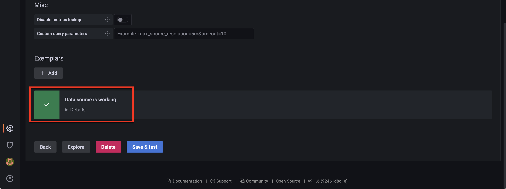
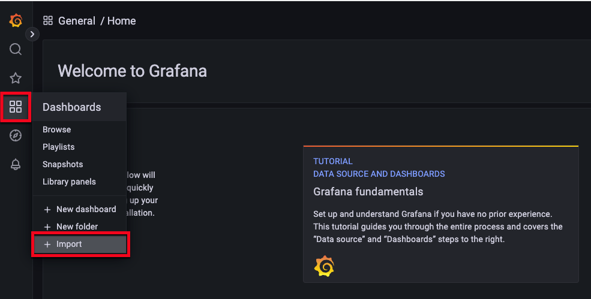
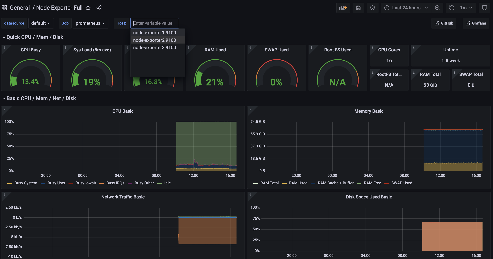

# Hands-on Lab: Monitoring in Action with Grafana 

##  Introduction
Welcome to the Monitoring with Grafana lab. In this lab you will learn to use Grafana as a visualization tool and dashboard for Prometheus.

##  Learning Objectives

After completing this exercise, you should be able to:
- Deploy Prometheus to OpenShift
- Deploy Grafana to OpenShift
- Connect Prometheus as a datasource for Grafana
- Create a dashboard with Grafana
## Prerequisites

There is some setup to do before you can proceed with the lab. In this prerequisite step you will clone the GitHub repository that contains the Kubernetes manifests needed to deploy Prometheus and Grafana to an OpenShift clutser in the lab environment.

## The Task

1. First, if you do not already have a terminal open, open a terminal using the top menu item  Terminal ->  New Terminal and  cd (change directory) into the default  /home/project folder:

>>> cd /home/project

2. Then use the git clone command to clone this repository:
>>> git clone https://github.com/ibm-developer-skills-network/ondaw-prometheus-grafana-lab.git

3. Finally, change into the ondaw-prometheus-grafana-lab folder:
>>> cd ondaw-prometheus-grafana-lab

4. (Optional) Make your command prompt shorter with this bash command:

>>> export PS1="\[\033[01;32m\]\u\[\033[00m\]:\[\033[01;34m\]\W\[\033[00m\]\$ "

##  Deploy node exporters:
In this step, you will deploy 3 Node Exporters, which will be used as monitoring targets.

## The Task
1. Use the oc create deployment command to deploy 3 node exporters, named node-exporter1, node-exporter2, and node-exporter3, all listening on port 9100.

>>> oc create deployment node-exporter1 --port=9100 --image=bitnami/node-exporter:latest
oc create deployment node-exporter2 --port=9100 --image=bitnami/node-exporter:latest
oc create deployment node-exporter3 --port=9100 --image=bitnami/node-exporter:latest

2. Next, use the oc expose command to create services that expose the 3 node exporters so that Prometheus can communicate with them:

>>> oc expose deploy node-exporter1 --port=9100 --type=ClusterIP
oc expose deploy node-exporter2 --port=9100 --type=ClusterIP
oc expose deploy node-exporter3 --port=9100 --type=ClusterIP

3. Check that the pods are up and running with the following oc command:

>>> oc get pods

## Results
You should see that all of the pods for the three node-exporters are in a running state like the image below:

##  Deploy Prometheus:
n this step, you will confiugure and deploy Prometheus. While normally you would modify configuration files to configure Prometheus, this is not the case for Kubernetes. For a Kubernetes environment the proper appoach is to use a ConfigMap. This makes it easy to change the configuraton later. You will find the configuration files from which to make the ConfigMap in a folder named ./config.

You will also need Kubernetes manifests to describe the Prometheus deployment and to link the ConfigMap with the Prometheus. These manifests can be found in the ./deploy  folder.

## The Task
Use the following commands to create a ConfigMap and deploy Prometheus:

1. First, create a ConfigMap called prometheus-config that is needed by Prometheus from the prometheus.yml and the alerts.yml file in the ./deploy folder.

>>> oc create configmap prometheus-config \
   --from-file=prometheus=./config/prometheus.yml \
   --from-file=prometheus-alerts=./config/alerts.yml

You should see a message that the prometheus-config was created.

2. Now deploy Prometheus using the deploy/prometheus-deployment.yaml deployment manifest.

>>> oc apply -f deploy/prometheus-deployment.yaml

You should see a message that the prometheus-volume-claim, deployment.apps/prometheus, and service/prometheus were all created.

3. Finally, use the oc command to check that the prometheus pod is running.

>>> oc get pods -l app=prometheus

## Results
You should see that the prometheus pod is in a running state.

##  Deploy Grafana:
Now that you have 3 node exporters to emit metrics, and Prometheus to collect them, it is time to add Grafana for dashboarding. You will deploy Grafana into OpenShift and create a route which will allow you to open up the Grafana web UI and work with it.

## The Task
1. First, deploy Grafana using the deploy/grafana-deployment.yaml deployment manifest.
>>> oc apply -f deploy/grafana-deployment.yaml

You should see a message that both the grafana deployment and service have been created.

2. Next, use the  oc expose command to expose the  grafana service with an OpenShift  route. Routes are a special feature of OpenShift that makes it easier to use for developers.
>>> oc expose svc grafana

Your should see the message: “route.route.openshift.io/prometheus exposed”

3. Use the following oc patch command to enable TLS and the https:// protocol for the route.
>>> oc patch route grafana -p '{"spec":{"tls":{"termination":"edge","insecureEdgeTerminationPolicy":"Redirect"}}}'

4. Then use the oc get routes command to check the URL that the route was assigned. You will be able to interact with Grafana using this URL.

>>> oc get routes

5. Finally, use the oc command to check that the grafana pod is running.
>>> oc get pods -l app=grafana

## Results
You should see that the grafana pod is in a running state.

You should also see the URL of the route that you created.

You are now ready to configure Grafana.

## Log in to Grafana:

Now that Prometheus and Grafana are deployed and running, it is time to configure Grafana. In order to do this, you will need the URL from the route that you created in the last step.

Note: You do not need a Grafana account in order to complete this step.

## The Task

1. Use the oc describe command along with grep to extract the URL of the Requested Host for the grafana route:

>>> oc describe route grafana | grep "Requested Host:"

You will see the words “Requested Host:” in red followed by a URL. It will start with the word “grafana-“ followed by the rest of the URL.

2. Copy the URL after the words “Requested Host:” to the clipboard and paste it into a new web browser window outside of the lab environment.
> You should see the Grafana log in page:
 
>> grafana-sn-labs-ahmedabdoami.labs-prod-openshift-san-a45631dc5778dc6371c67d206ba9ae5c-0000.us-east.containers.appdomain.cloud

3. From the Grafana login screen, log in with the default userid admin and default password admin, and then click the [Log in] button. You will be prompted to change your password. You can press the skip link to bypass that for now.

## Results
You should see the Grafana home page:

##  Configure Grafana:

Once you have logged in to Grafana, you can configure Prometheus as your datasource.

## The Task
1. At the home page, select the data sources icon.

2. At the Add data source page select Prometheus.

3. On the Prometheus configuration page, set the Prometheus URL to http://prometheus:9090 which is the name and port of the Prometheus service in OpenShift.

4. Scroll down to the bottom of the screen and click the Save & test button.

## Results
You should see a message, confirming that the data source is working:

##  Create a Dashboard:
Now you can create your first dashboard. For this lab, you will use a precreated template provided by Grafana Dashboard. This template is identified by the id 1860.

## The Task
1. On the Grafana homepage, click the Dashboards icon, and select + Import from the menu to start creating the dashboard.

2. Next,enter the template identifier id 1860 in the space provided and click the [Load] button to import that dashboard from Grafana.

3. You will see the default name for the template, Node Exporter Full, displayed. You are allowed to change it if you want to. The change will be local and valid only for your instance.

4. At the bottom of the page, choose Prometheus (Default) as the data source and click Import.

This completes importing a dashboard. Next you will see what the dashboard allows you to monitor.

##  View the Dashboard: 

You should now see the General / Node Exporter Full dashboard which shows CPU Busy, Sys Load, RAM used and other information. This dashboard will allow you to get a broad overview of how the system is performing, as well as drilling down into individual nodes to see how they are performing. Now, try a few things out.

## Things to try
1. You can hover over the graph to get specific information at a given time.

2. Choose a different host to observe the details about that host.

3. Choose to visualize the metrics over different time ranges.

As you can imagine, this could be monitoring an application that you have deployed into Kubernetes or OpenShift so that you can see the CPU, Memory, and other metrics to determine the overall health of your application.